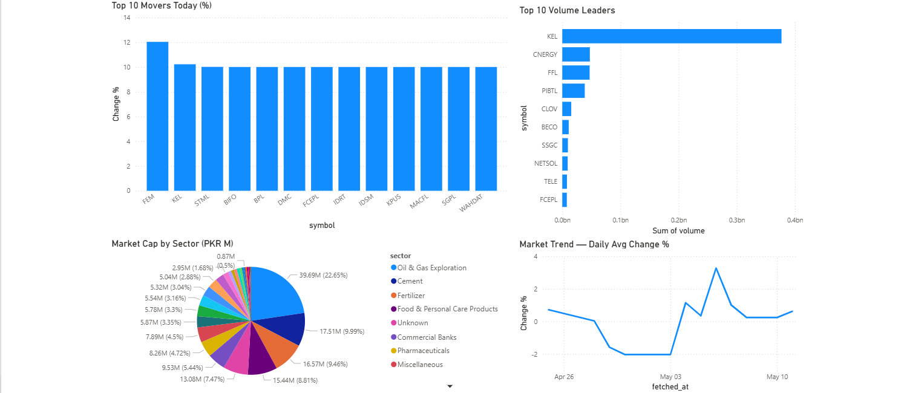

# PSX Data Engineering Pipeline — Airflow Edition

An end-to-end data engineering project that ingests daily Pakistan Stock Exchange (PSX) market data, orchestrates transformations through a Medallion architecture using dbt, and serves analytics-ready datasets for market analysis.

## Architecture

```
PSX Data → PostgreSQL Bronze Layer (PsxAllShr)
                        ↓
           dbt Staging Model (Silver)
                        ↓
          ┌─────────────┴─────────────┐
          ↓                           ↓
 mart_top_movers (Gold)   mart_sector_summary (Gold)
```

## Dashboard

Power BI dashboard built on the Gold layer — updated daily with live PSX data.



> Built with Power BI Desktop connected directly to Neon PostgreSQL gold layer.
> Download [`PSX-Dashboard.pbix`](dashboard/PSX-Dashboard.pbix) to explore interactively.

## Pipeline DAG

Three tasks run sequentially, triggered manually on trading days:

```
seed_dbt → run_dbt → test_dbt
```

| Task | Description |
|---|---|
| `seed_dbt` | Loads sector mapping reference data via dbt seed |
| `run_dbt` | Runs staging and mart transformation models |
| `test_dbt` | Executes dbt data quality tests |

## Tech Stack

| Layer | Technology |
|---|---|
| Orchestration | Apache Airflow 3.x (Astronomer Runtime 3.2-3) |
| Storage | PostgreSQL (Neon) |
| Transformation | dbt-core 1.11.8, dbt-postgres 1.10.0 |
| Data Quality | dbt tests (not_null, unique) |
| Alerting | Airflow failure callbacks with retries |
| Development | GitHub Codespaces, Astro CLI |
| Version Control | Git, GitHub |

## Project Structure

```
psx-airflow/
├── dags/
│   └── psx_pipeline.py          # Main Airflow DAG
├── dashboard/
│   ├── PSX-Dashboard.pbix       # Power BI report file
│   └── PSX-Dashboard.png        # Dashboard screenshot
├── include/
│   └── psx_analytics/           # dbt project
│       ├── models/
│       │   ├── staging/
│       │   │   ├── stg_psx_daily_snapshot.sql
│       │   │   ├── stg_psx_daily_snapshot.yml
│       │   │   └── sources.yml
│       │   └── marts/
│       │       ├── mart_top_movers.sql
│       │       └── mart_sector_summary.sql
│       └── seeds/
│           └── psx_sector_mapping.csv
├── Dockerfile
├── requirements.txt
└── .env
```

## Data Models

### Bronze Layer — `PsxAllShr`
Raw daily snapshot ingested from PSX. All fields stored as-is, completely untouched. Serves as the immutable source of truth.

### Silver Layer — `stg_psx_daily_snapshot`
Cleaned and typed view built on top of raw Bronze data. Strips commas and percentage signs, casts all numeric fields to correct types, deduplicates by latest record per symbol per day, and nullifies empty strings.

### Gold Layer — `mart_top_movers`
All PSX-listed stocks ranked by daily change percentage. Rebuilt as a table on every pipeline run.

### Gold Layer — `mart_sector_summary`
Sector-level aggregations per day — total market cap, total volume, average change percentage, and average price grouped by sector.

## Reliability

- **Retries:** Each task retries 3 times with a 5-minute delay before failing
- **Failure callbacks:** Logs task and DAG name on every failure for observability
- **dbt tests:** Data quality checks run automatically after every transformation

## Setup

### Prerequisites
- Docker Desktop
- [Astro CLI](https://docs.astronomer.io/astro/cli/install-cli)
- PostgreSQL instance (Neon free tier works)

### Installation

```bash
git clone https://github.com/muzzamilanis/psx-airflow
cd psx-airflow
```

Create a `.env` file with your Neon credentials:

```env
NEON_HOST=your-neon-host
NEON_USER=your-user
NEON_PASSWORD=your-password
NEON_DB=PsxDataLake
```

Configure `include/psx_analytics/profiles.yml`:

```yaml
psx_analytics:
  target: dev
  outputs:
    dev:
      type: postgres
      host: your-neon-host
      port: 5432
      user: your-user
      password: your-password
      dbname: PsxDataLake
      schema: public
      sslmode: require
      connect_timeout: 30
```

### Run

```bash
astro dev start
```

Open [http://localhost:8080](http://localhost:8080) with `admin` / `admin`.

Add a connection under **Admin → Connections**:
- **Connection Id:** `neon_postgres`
- **Connection Type:** `Postgres`
- **Host / Schema / Login / Password / Port:** your Neon credentials

Trigger the `psx_pipeline` DAG.

## Sample Output

**Top movers — 2026-04-28:**

| Symbol | Name | Price (PKR) | Change % | Volume |
|---|---|---|---|---|
| TRSM | Trust Modaraba | 17.24 | +10.02% | 2,082,863 |
| MSCL | Metropolitan Steel | 26.25 | +10.02% | 2,021,553 |
| FCEPL | Frieslandcampina Engro | 85.87 | +10.01% | 1,842,353 |

**Sector summary — 2026-04-28:**

| Sector | Avg Change % | Total Market Cap (M) |
|---|---|---|
| Oil & Gas Exploration | -0.75% | 2,759,643 |
| Fertilizer | -0.95% | 1,011,184 |
| Cement | -1.32% | 732,124 |

## Roadmap
- [x] Power BI dashboard — Top Movers, Volume Leaders, Sector Market Cap, Market Trend
- [ ] Tableau Public dashboard — public shareable URL
- [ ] Add historical trend marts (30-day moving average, RSI)
- [ ] Deploy to Astro Cloud

## Author
Muhammad Muzzamil
[LinkedIn](https://linkedin.com/in/muzzamil-nagda) · [GitHub](https://github.com/muzzamilanis)
