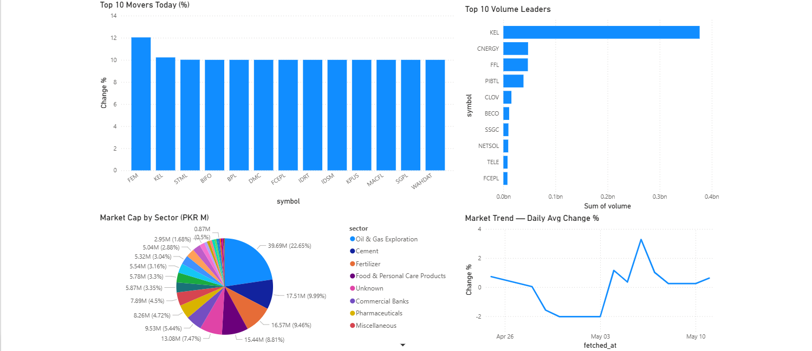

# PSX Data Engineering Pipeline

An end-to-end data engineering project that ingests daily Pakistan Stock Exchange (PSX) market data, orchestrates transformations through a Medallion architecture using dbt, tracks a personal portfolio (holdings, realized P&L, CGT), and emails a daily summary — all running unattended on GitHub Actions.

## Architecture

```
Local Scraper (Windows Task Scheduler)      yfinance (GitHub Actions, daily)
         ↓                                              ↓
Neon PostgreSQL — Bronze Layer                Neon PostgreSQL — Bronze Layer
      (PsxAllShr)                                (psx_price_history)
         ↓                                              ↓
stg_psx_daily_snapshot (Silver)              stg_psx_price_history (Silver)
         ↓                                              ↓
         ├── mart_top_movers                            └── mart_technical_indicators
         ├── mart_sector_summary
         ├── mart_portfolio_snapshot
         ├── mart_portfolio_summary
         ├── mart_portfolio_trades (seed: portfolio_trades)
         └── mart_cgt_summary (seed: portfolio_cgt_monthly)
                    ↓                    ↓
              Daily email (Gmail SMTP)   Power BI Dashboard (Neon)

                    ⋮ optional / not run in daily automation ⋮
              Neon → Snowflake sync → dbt on Snowflake (parallel target)
```

Two independent price feeds land in the Bronze layer: a local scraper writes the live PSX board snapshot (`PsxAllShr`), while a GitHub Actions job pulls daily OHLCV bars from `yfinance` (`psx_price_history`). Portfolio valuation (`mart_portfolio_snapshot`) is priced off the board snapshot; technical indicators are computed off the OHLCV history — so the two can show different "as of" dates on any given day.

## Dashboard

Power BI dashboard built on the Gold layer — updated daily with live PSX data.



> Built with Power BI Desktop connected directly to Neon PostgreSQL gold layer.
> Download [`PSX-Dashboard.pbix`](dashboard/PSX-Dashboard.pbix) to explore interactively.

## Daily Automation (GitHub Actions)

`.github/workflows/daily_pipeline.yml` is what actually runs in production — Mon–Fri at 13:15 UTC (18:15 PKT), plus manual `workflow_dispatch`. It runs standalone (no Airflow involved):

```
fetch_ohlcv_data.py → dbt deps → dbt build (seed+run+test) → send_daily_email.py
```

| Step | Description |
| --- | --- |
| Fetch day-end PSX prices | `scripts/fetch_ohlcv_data.py` pulls 5 days of OHLCV bars per symbol from `yfinance` and upserts into `psx_price_history` (`ON CONFLICT (symbol, price_date) DO NOTHING`) |
| dbt deps | Installs `dbt_utils` |
| dbt build | Seeds + runs + tests every staging and mart model against the Neon Postgres target (`.github/dbt/profiles.yml`, connection parsed from the `NEON_DATABASE_URL` secret) |
| Send daily portfolio email | `scripts/send_daily_email.py` queries the Gold layer and emails an HTML summary via Gmail SMTP |

Required GitHub secrets: `NEON_DATABASE_URL`, `SMTP_USER`, `SMTP_PASSWORD`, `EMAIL_TO`.

## Daily Email

Sent to `EMAIL_TO` after every successful `dbt build`, built from `mart_portfolio_summary`, `mart_portfolio_snapshot`, `mart_portfolio_trades`, and `mart_technical_indicators`:

- Portfolio summary — total invested, current value, unrealized P&L, realized P&L (all closed trades), holdings count
- Per-ticker day change table — price, day change %, value, unrealized P&L
- Per-ticker technicals line — e.g. `LUCK — vs 200DMA: +1% | RSI: 45 | vol: 0.9x` (falls back to `n/a` for symbols/fields without enough OHLCV history yet)

## Airflow DAG (local / Codespaces dev)

`dags/psx_pipeline.py` is the original Astro/Airflow orchestration, run manually via `astro dev start` in GitHub Codespaces. Its active path mirrors the GitHub Actions job:

```
fetch_ohlcv_data >> seed_dbt >> run_dbt >> test_dbt
```

It also defines `sync_neon_to_snowflake`, `seed_dbt_snowflake`, and `run_dbt_snowflake` tasks for mirroring the Gold layer to Snowflake on a parallel dbt target — these are currently commented out of the DAG graph and not part of the daily run, but the models and cross-database macros stay compatible with that target (see [`include/neon_to_snowflake_sync.py`](include/neon_to_snowflake_sync.py)).

| Task | Description |
| --- | --- |
| `fetch_ohlcv_data` | Same OHLCV fetch as the GitHub Actions step, using `NEON_HOST`/`NEON_PASSWORD` Airflow variables instead of a DSN |
| `seed_dbt` | Loads sector mapping, portfolio holdings, trades, and CGT seed data via dbt (Neon) |
| `run_dbt` | Runs staging and mart transformation models on Neon PostgreSQL |
| `test_dbt` | Executes the dbt data quality test suite |
| `sync_neon_to_snowflake` *(disabled)* | Syncs `PsxAllShr` from Neon PostgreSQL to Snowflake, incrementally by `id` |
| `seed_dbt_snowflake` *(disabled)* | Loads seed data on the Snowflake target |
| `run_dbt_snowflake` *(disabled)* | Runs all dbt models on Snowflake using cross-database macros |

## Tech Stack

| Layer | Technology |
| --- | --- |
| Daily automation | GitHub Actions (scheduled + manual workflow) |
| Orchestration (local/dev) | Apache Airflow 3.x (Astronomer Runtime), GitHub Codespaces, Astro CLI |
| Primary Storage | PostgreSQL (Neon) |
| Cloud Warehouse (optional target) | Snowflake |
| Ingestion | Local scraper → `PsxAllShr`; `yfinance` (`scripts/fetch_ohlcv_data.py`) → `psx_price_history` |
| Transformation | dbt-core, dbt-postgres, dbt-snowflake |
| Cross-DB Compatibility | Custom dbt macros — `safe_cast`, `quote_column`, `cast_date`, `round_numeric` |
| Data Quality | dbt_utils 1.3.0 — 33 tests (not_null, unique, relationships, expression_is_true, unique_combination_of_columns) |
| Reporting | `scripts/send_daily_email.py` — Gmail SMTP |
| Alerting | Airflow failure callbacks with retries |
| Visualization | Power BI Desktop connected to Neon PostgreSQL gold layer |
| Version Control | Git, GitHub |

## Project Structure

```
psx-airflow/
├── dags/
│   └── psx_pipeline.py              # Airflow DAG (local/Codespaces dev)
├── dashboard/
│   ├── PSX-Dashboard.pbix           # Power BI report file
│   └── PSX-Dashboard.png            # Dashboard screenshot
├── scripts/
│   ├── fetch_ohlcv_data.py          # yfinance OHLCV → psx_price_history (standalone, used by GH Actions)
│   └── send_daily_email.py          # Renders + sends the daily HTML summary email
├── .github/
│   ├── workflows/
│   │   └── daily_pipeline.yml       # Production automation: fetch → dbt build → email
│   └── dbt/
│       └── profiles.yml             # CI-only dbt profile, populated from NEON_DATABASE_URL
├── include/
│   ├── neon_to_snowflake_sync.py    # Standalone Neon→Snowflake sync (mirrors the disabled DAG task)
│   └── psx_analytics/               # dbt project
│       ├── models/
│       │   ├── staging/
│       │   │   ├── stg_psx_daily_snapshot.sql/.yml   # Silver — cleaned PsxAllShr
│       │   │   ├── stg_psx_price_history.sql/.yml    # Silver — typed OHLCV
│       │   │   └── sources.yml
│       │   └── marts/
│       │       ├── mart_top_movers.sql
│       │       ├── mart_sector_summary.sql
│       │       ├── mart_portfolio_snapshot.sql
│       │       ├── mart_portfolio_summary.sql
│       │       ├── mart_portfolio_trades.sql
│       │       ├── mart_cgt_summary.sql
│       │       ├── mart_technical_indicators.sql
│       │       └── schema.yml
│       ├── macros/
│       │   └── safe_cast.sql        # safe_cast, quote_column, cast_date, round_numeric
│       └── seeds/
│           ├── psx_sector_mapping.csv
│           ├── portfolio_holdings.csv
│           ├── portfolio_trades.csv
│           └── portfolio_cgt_monthly.csv
├── Dockerfile
├── requirements.txt                 # Astro/Airflow runtime deps
├── requirements-ci.txt              # GitHub Actions job deps only
└── .env
```

## Data Models

### Bronze Layer — `PsxAllShr`
Raw daily board snapshot ingested from PSX by the local scraper. All fields stored as-is, completely untouched. Serves as the immutable source of truth for live price/change/volume.

### Bronze Layer — `psx_price_history`
Raw daily OHLCV bars (`open`, `high`, `low`, `close`, `volume`, `dividends`, `stock_splits`) per symbol, fetched from `yfinance` and upserted daily. Unique on `(symbol, price_date)`.

### Silver Layer — `stg_psx_daily_snapshot`
Cleaned and typed view built on top of raw Bronze snapshot data. Strips commas and percentage signs, casts all numeric fields to correct types, deduplicates by latest record per symbol per day, and nullifies empty strings.

### Silver Layer — `stg_psx_price_history`
Typed pass-through view over `psx_price_history` (already structured on write, so no `safe_cast`/string-cleanup needed).

### Gold Layer — `mart_top_movers`
All PSX-listed stocks ranked by daily change percentage. Rebuilt as a table on every pipeline run.

### Gold Layer — `mart_sector_summary`
Sector-level aggregations per day — total market cap, total volume, average change percentage, and average price grouped by sector.

### Gold Layer — `mart_technical_indicators`
One row per symbol, latest trading day only, computed from `psx_price_history` with plain SQL window functions: 50- and 200-day SMA of close (and close's % distance from each), 14-day RSI, 52-week high/low from daily high/low (and % distance from the high), and 20-day average volume with the latest volume's ratio to it. Indicators are nulled until enough trading history exists to back them (e.g. no 200-day SMA before 200 rows).

## Portfolio Analytics

Personal PSX portfolio tracked via the `portfolio_holdings` seed — 9 symbols total (ISL, KEL, LUCK, NATF, OGDC, SYS, CLOV, FFC, SEARL), 8 currently `active` and NATF marked `sold`.

| Model | Description |
| --- | --- |
| `mart_portfolio_snapshot` | Daily mark-to-market per **active** holding — current price, cost basis, gain/loss PKR, gain/loss %, portfolio weight |
| `mart_portfolio_summary` | Aggregate portfolio metrics — total invested, total current value, total gain/loss, weighted avg change |
| `mart_portfolio_trades` | Realized P&L per closed (sell) trade from the `portfolio_trades` seed — matches each sell against the symbol's average buy rate and broker charges |
| `mart_cgt_summary` | Capital Gains Tax rollup by broker and month from the `portfolio_cgt_monthly` seed — net gain/loss, provisional CGT, cumulative payable/collected, shortfall/refund |

All portfolio models run on Neon (and, when the Snowflake path is enabled, on Snowflake via the same cross-database macros).

## Reliability

- **Retries:** Airflow tasks retry 3 times with a 5-minute delay before failing
- **Failure callbacks:** Logs task and DAG name on every Airflow failure for observability
- **dbt tests:** 33 data quality checks (not_null, unique, relationships, expression_is_true, unique_combination_of_columns) run automatically after every transformation, both in CI and in Airflow

## Setup

### Prerequisites
- Docker Desktop
- [Astro CLI](https://docs.astronomer.io/astro/cli/install-cli)
- PostgreSQL instance (Neon free tier works)

### Installation

```bash
git clone https://github.com/muzzamilanis/psx-airflow
cd psx-airflow
```

Create a `.env` file with your Neon credentials:

```env
NEON_HOST=your-neon-host
NEON_USER=your-user
NEON_PASSWORD=your-password
NEON_DB=PsxDataLake
```

Configure `include/psx_analytics/profiles.yml`:

```yaml
psx_analytics:
  target: dev
  outputs:
    dev:
      type: postgres
      host: your-neon-host
      port: 5432
      user: your-user
      password: your-password
      dbname: PsxDataLake
      schema: public
      sslmode: require
      connect_timeout: 30
```

### Run locally (Airflow)

```bash
astro dev start
```

Open [http://localhost:8080](http://localhost:8080) with `admin` / `admin`.

Add a connection under **Admin → Connections**:
- **Connection Id:** `neon_postgres`
- **Connection Type:** `Postgres`
- **Host / Schema / Login / Password / Port:** your Neon credentials

Trigger the `psx_pipeline` DAG.

### Run the production automation (GitHub Actions)

Set these repo secrets, then either wait for the Mon–Fri 13:15 UTC cron or trigger `Daily PSX Pipeline` manually from the Actions tab:

| Secret | Used for |
| --- | --- |
| `NEON_DATABASE_URL` | Postgres DSN for `fetch_ohlcv_data.py`, `dbt build`, and `send_daily_email.py` |
| `SMTP_USER` / `SMTP_PASSWORD` | Gmail SMTP login for sending the daily email |
| `EMAIL_TO` | Recipient of the daily email |

## Sample Output

**Top movers — 2026-04-28:**

| Symbol | Name | Price (PKR) | Change % | Volume |
|---|---|---|---|---|
| TRSM | Trust Modaraba | 17.24 | +10.02% | 2,082,863 |
| MSCL | Metropolitan Steel | 26.25 | +10.02% | 2,021,553 |
| FCEPL | Frieslandcampina Engro | 85.87 | +10.01% | 1,842,353 |

**Sector summary — 2026-04-28:**

| Sector | Avg Change % | Total Market Cap (M) |
|---|---|---|
| Oil & Gas Exploration | -0.75% | 2,759,643 |
| Fertilizer | -0.95% | 1,011,184 |
| Cement | -1.32% | 732,124 |

**Technical indicators — 2026-08-02:**

| Symbol | Close | vs 50DMA | vs 200DMA | RSI (14) | 52w High | vol vs 20d avg |
|---|---|---|---|---|---|---|
| LUCK | 449.08 | -0.77% | +1.30% | 45.4 | 529.50 | 0.94x |
| OGDC | 319.09 | -2.44% | +8.75% | 39.1 | 352.00 | 0.98x |
| SYS | 133.12 | -8.31% | -9.56% | 35.3 | 172.10 | 1.08x |

## Roadmap
- [x] Power BI dashboard — Top Movers, Volume Leaders, Sector Market Cap, Market Trend
- [x] Daily automation via GitHub Actions (no Airflow dependency for production runs)
- [x] OHLCV history pipeline + technical indicators mart (moving averages, RSI, 52-week range, volume ratio)
- [x] Daily email report with per-ticker technicals
- [ ] Surface `mart_cgt_summary` in the dashboard/email (currently dbt-only)
- [ ] Re-enable or retire the Snowflake sync path (currently commented out of the DAG)
- [ ] Tableau Public dashboard — public shareable URL
- [ ] Deploy Airflow to Astro Cloud

## Author
Muhammad Muzzamil
[LinkedIn](https://linkedin.com/in/muzzamil-nagda) · [GitHub](https://github.com/muzzamilanis)
